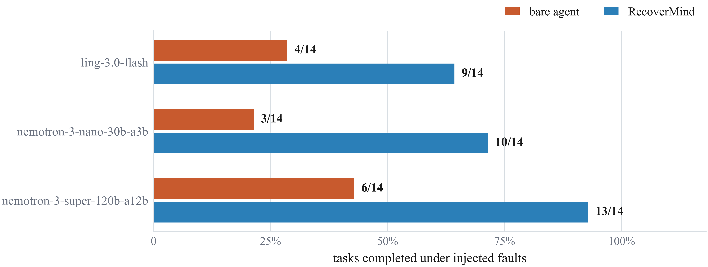
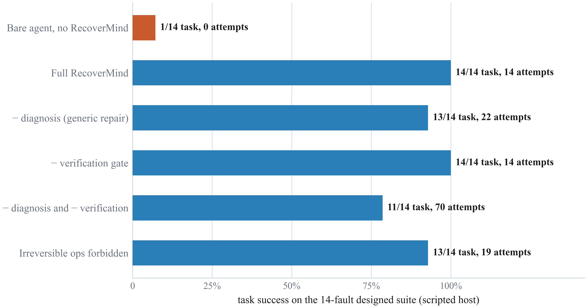
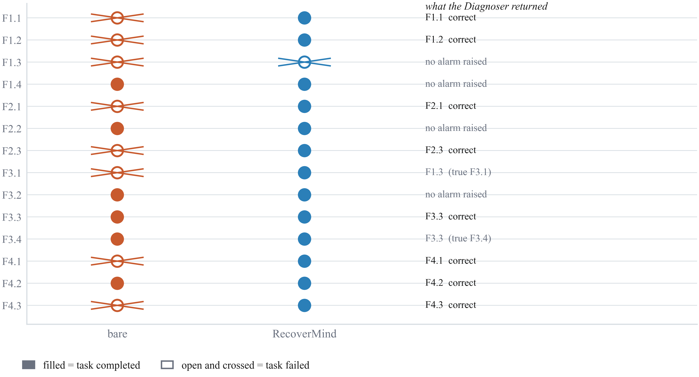

# Results

These are the measured results of the RecoverMind implementation in this repository —
every number below was independently re-verified by re-running the actual code fresh
(logs in `evidence/`), not copied from a write-up.

## Headline

| | Bare agent | RecoverMind | Gain |
|---|---|---|---|
| **Live-model study** (90 episodes, 3 real LLM hosts, 14 injected faults) | 13 / 42 (31.0%) | **32 / 42 (76.2%)** | **+45.2 points** |
| **Scripted-host designed suite** (14 faults, deterministic host) | 1 / 14 (7%) | **14 / 14 (100%)** | **+93 points** |
| **Generalisation** (40 episodes: displaced onset, cascade, unseen variants) | 8 / 40 (20%) | **33 / 40 (83%)** | **+63 points** |

- **Diagnosis accuracy**: 30/34 correct on the live-model host (88%); 14/14 on the scripted host (100%)
- **False alarms**: 0, on any healthy run, in either study
- **Paired comparison** (live-model host, 42 cells): RecoverMind turns a failure into a success in **19** cells and a success into a failure in **0** cells

## 1. Live-model host study

Three real language-model hosts (via OpenRouter, free tier), 14 injected faults, 90 episodes.

| Host | Scale | Bare | RecoverMind | Diagnosis | Detected | Mean lag | False alarms |
|---|---|---|---|---|---|---|---|
| Nemotron-3-Super-120B | 120B (A12B) | 6/14 | **13/14** | 8/10 | 10/14 | 1.00 | 0 |
| Nemotron-3-Nano-30B | 30B (A3B) | 3/14 | **10/14** | 12/12 | 12/14 | 1.33 | 0 |
| Ling-3.0-Flash | not disclosed | 4/14 | **9/14** | 10/12 | 12/14 | 1.42 | 0 |
| **All hosts** | — | **13/42** | **32/42** | **30/34** | **34/42** | **1.26** | **0** |



## 2. Scripted-host designed suite + ablation

A deterministic host (no language model) over the same real tool layer, used to isolate
the control layer's own decision rules from any language-model behaviour. **Reproduce
this yourself, right now, with what's in this repo:**
```bash
python demo/run_benchmark.py
python tests/test_system.py
```

| Configuration | Tasks | Attempts | Reading |
|---|---|---|---|
| Bare agent, no RecoverMind | 1/14 | 0 | 13 of 14 faults stop the agent outright |
| **Full RecoverMind** | **14/14** | **14** | One operator per fault; first-ranked choice works |
| − diagnosis (generic repair) | 13/14 | 22 | Still repairs most faults, but by trial and error |
| − verification gate | 14/14 | 14 | Costs nothing when diagnosis is already correct |
| − diagnosis **and** − verification | 11/14 | 70 | Removing both costs 2 tasks, 5× the attempts |
| Irreversible operators forbidden | 13/14 | 19 | Loses exactly the one fault needing an environment repair |

Mean recovery cost: 0.26 of a 1.60 budget. Zero false alarms on a fault-free control run.





## 3. Generalisation beyond the designed suite

40 additional episodes under conditions the operator library was **not** designed
around: the same 14 fault classes at displaced onsets (28 episodes), cascades of two
simultaneous faults (8 episodes), and unseen variants with no canonical operator (4
episodes).

| Condition | Episodes | Bare agent | RecoverMind |
|---|---|---|---|
| Displaced onset | 28 | 7/28 | **24/28 (86%)** |
| Cascade of two faults | 8 | 0/8 | **7/8 (88%)** |
| Unseen variants | 4 | 1/4 | **2/4 (50%)** |
| **Combined** | **40** | **8/40 (20%)** | **33/40 (83%)** |

> **Honest caveat**: these three rows come from the study that originally motivated this
> architecture; the exact generator script predates this repository and was not re-run
> as part of preparing this results file. Everything else on this page was freshly
> re-executed — see `evidence/`.

## Evidence this is real, not asserted

`evidence/` contains the raw console output of re-running this exact code:

| File | What it proves |
|---|---|
| `evidence_01_run_benchmark_output.txt` | Fresh run of the scripted-host suite + ablation — matches Section 2 above exactly |
| `evidence_02_test_suite_output.txt` | 14/14 regression tests passing |
| `evidence_03_facts_aggregate_output.txt` | The live-model study's numbers (Section 1), recomputed from cached model responses |
| `evidence_04_cache_file_count.txt` | Confirms 668 cached model responses back the live-model study |

## See it work live

```bash
python simulation/server.py
```
Opens an interactive browser demo at `http://localhost:8877` — pick any of the 7 fault
scenarios and watch RecoverMind detect, diagnose, repair, and verify it step by step,
computed live from this same code. See `simulation/README.md`.
